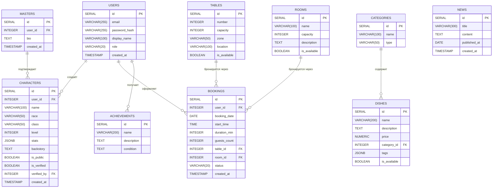

## Описание связей

| Связь | Тип | Описание |
|---|---|---|
| USERS → CHARACTERS | 1:N | У одного пользователя много персонажей |
| MASTERS → CHARACTERS | 1:N | Один мастер может подтвердить много персонажей |
| USERS → BOOKINGS | 1:N | Один пользователь может оформить много бронирований |
| TABLES → BOOKINGS | 1:N | Один столик может быть забронирован много раз |
| Rooms → BOOKINGS | 1:N | Одна комната может быть забронирована много раз |
| CATEGORIES → DISHES | 1:N | В одной категории много блюд |
| USERS ↔ ACHIEVEMENTS | M:N | Пользователь может получить много достижений |

---

## Вопросы для самопроверки

**1. Чем связь 1:N отличается от M:N? Приведите пример каждой из вашего проекта.**

1:N к примеру как в моей таблице, USERS → CHARACTERS у одного пользователя может быть много персонажей, но у каждого  персонажа только один пользователь.
M:N к примеру как в моей таблице, USERS ↔ ACHIEVEMENTS у одного пользователя может быть много достижений, так и у одного достижения может множество пользователей.

**2. Почему связь M:N нельзя реализовать двумя таблицами? Зачем нужна промежуточная?**

Потому что тогда можно будет хранить только значение у каждого, как в USERS ↔ ACHIEVEMENTS если не сделать промежуточную таблицу то у пользователя может быть только одно достижение, так и у достижение может быть только у одного пользователя. Поэтому промежуточная таблица хранит в себе пары и множество к множеству может работать.

**3. Что будет, если удалить запись, на которую ссылается FK? (Подумайте, мы разберём это на лекции)**

Тогда появятся ошибки, поэтому у *ON DELETE* есть *CASCADE* - который удаляет все что связано с этой записью, *SET NULL* - поставить во всех связанных NULL, и *RESTRICT* - не удаляет если есть связи.

**4. Может ли FK быть NULL? Когда это полезно?**

Да, может. Если NULL то это значит что связь необязательна, к примеру персонажу нужно подтверждение, которое может поставить мастер, а без мастера персонаж и так может существовать.

---

## ERD-диаграмма

